<p align="center"></p>

<p align="center"><b>A Pokémon save editor and bank for Android, support dual-screen handhelds.</b></p>

<p align="center">
  <a href="https://discord.gg/bMtzZmTDfu"></a>
  <a href="https://github.com/sofianeelhor/PKForge/releases"></a>
  <a href="LICENSE"></a>
</p>

---


A Pokémon save editor and cross-generation Bank for Android, tuned for dual-screen
handhelds like the AYN Thor.
Built on [PKHeX.Core](https://github.com/kwsch/PKHeX) with the
[Auto Legality Mod](https://github.com/santacrab2/PKHeX-Plugins) compiled in-process, so
legalizing a Pokémon works fully offline, on device.

Not affiliated with Nintendo, Game Freak, or The Pokémon Company.

## Features

- **Manage your Pokémon.** Open any save from a linked emulator or a single file and
  take full control of your team and boxes. Edit stats, IVs, EVs, moves, Met/Origin,
  Tera type, Hyper Training, shininess, and more, with a live legality check as you go.
- **One-tap legalize.** The Auto Legality Mod is compiled in-process, so legalizing a
  Pokémon works fully offline, on device.
- **Move Pokémon between games.** Grab a Pokémon from one save and drop it into another
  — across generations, from a Gen 3 cartridge to a Gen 9 one. PKForge handles the
  transfer smoothly, so your team can travel with you from game to game.
- **A Bank like Pokémon Home.** Store your whole collection in a cross-game Bank with
  unlimited themed boxes. Organize with the gamepad, keep living dexes, and pull
  anything back out into any save whenever you need it.
- **Track your collection.** The Living Dex tracker follows all 1025 Pokémon across
  every generation, including shiny variants, so you always know what you still need.
- **Browse and inject events.** The full Mystery Gift database is bundled and works
  offline. Browse Wonder Cards from old distributions and inject them straight into
  your save.
- **Edit everything else.** The bag editor handles any pouch, any item, any quantity.
  The trainer card editor changes your name, IDs, money, and gender. RNG tools inspect
  PID, IVs, and nature, and can reroll a nature while keeping shininess.
- **Play with your Pokémon.** The Poképark is a living habitat where your Pokémon
  wander while you're away. The Nuzlocke report tracks first encounters and dupes per
  route, and the encounter browser shows every way to catch a species in each game.
- **Share your teams.** Import and export Showdown sets, and generate QR codes to move
  a set between devices.
- **Keep your saves safe.** Every write follows validate → backup → atomic write, and
  restore points capture every change exactly, so nothing is ever lost.

## Screenshots

<p align="center">
  
  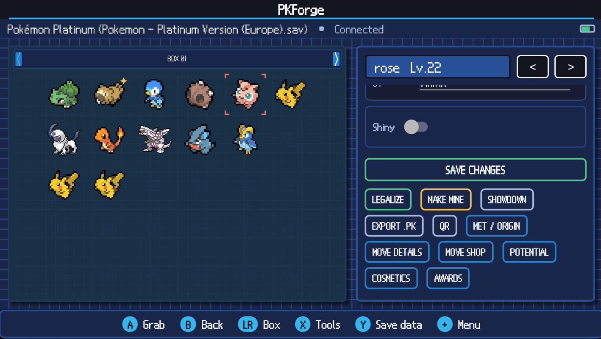
</p>

<p align="center">
  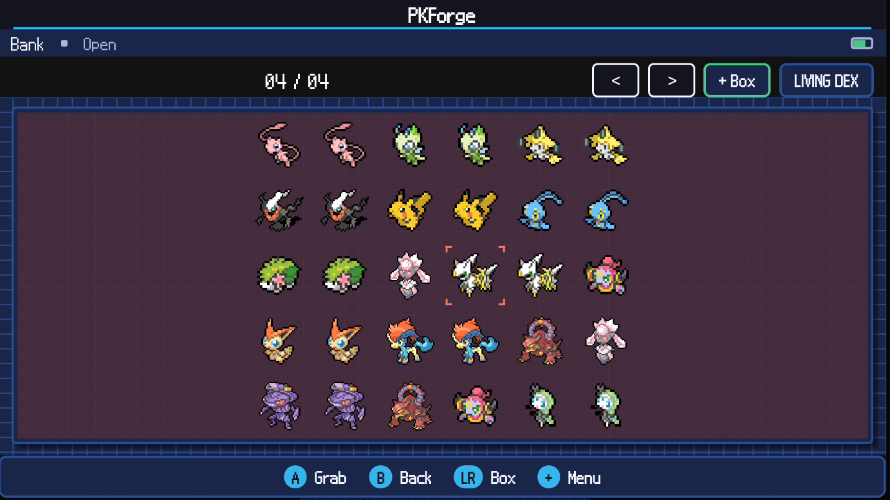
  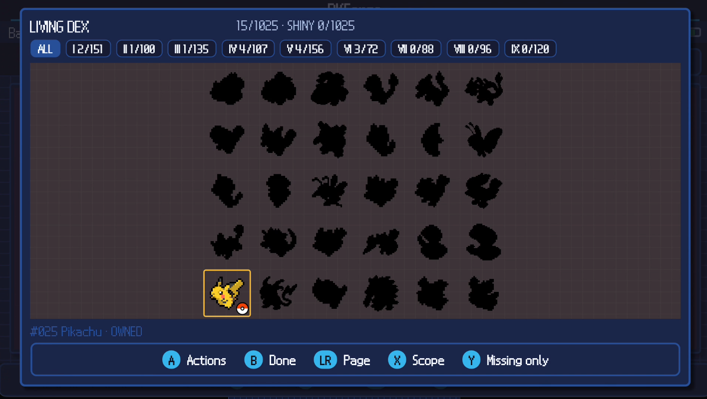
</p>

<p align="center">
  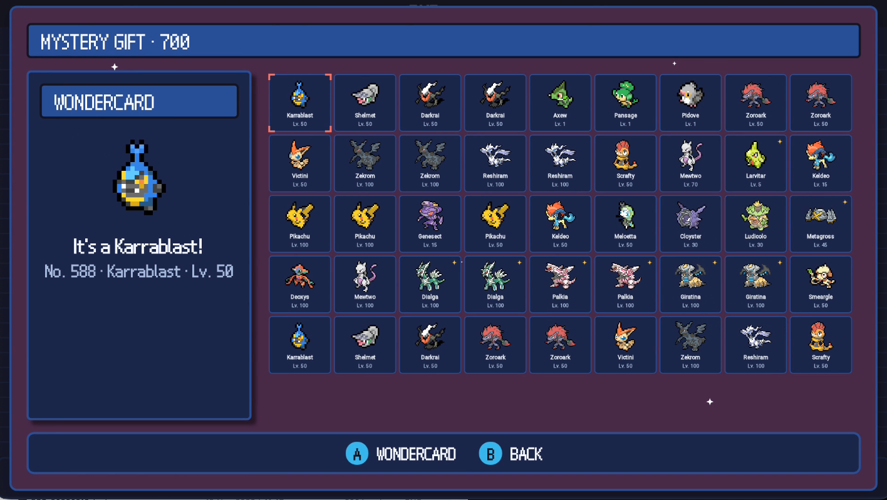
  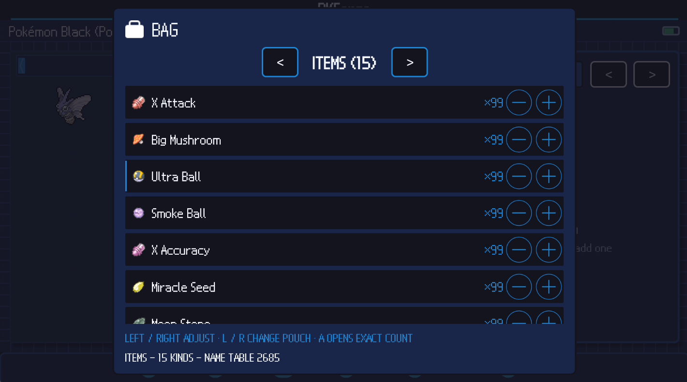
</p>

<p align="center">
  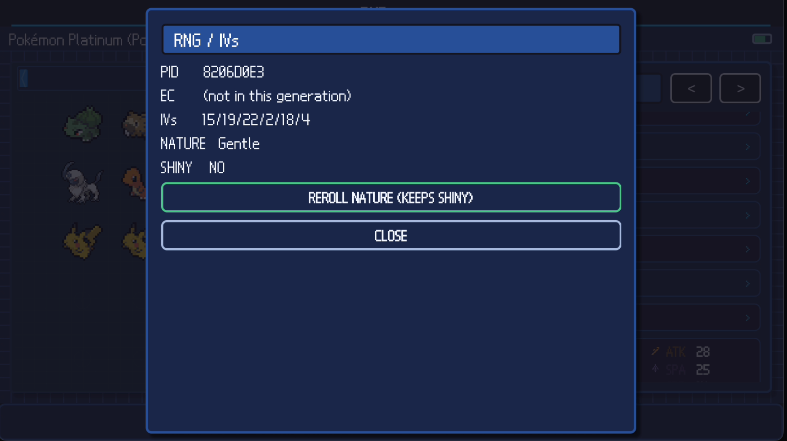
  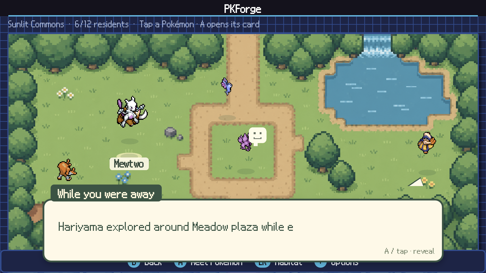
</p>

<p align="center">
  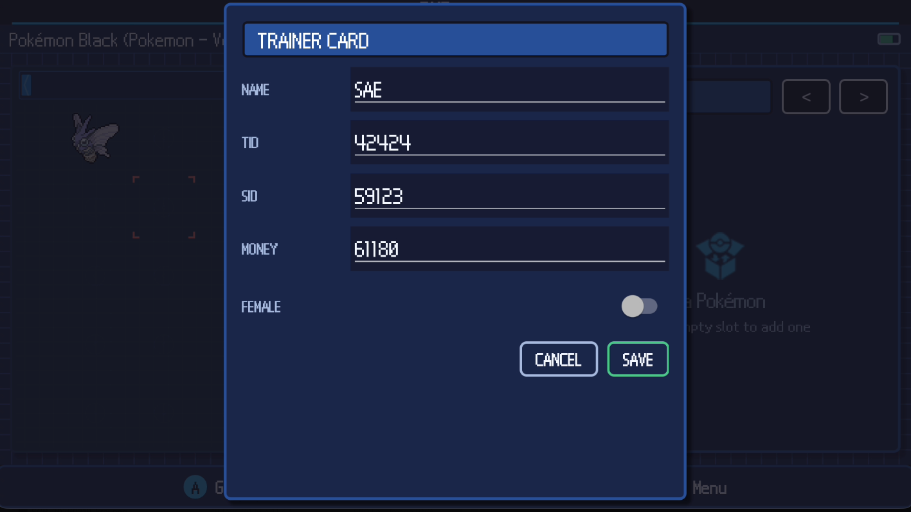
  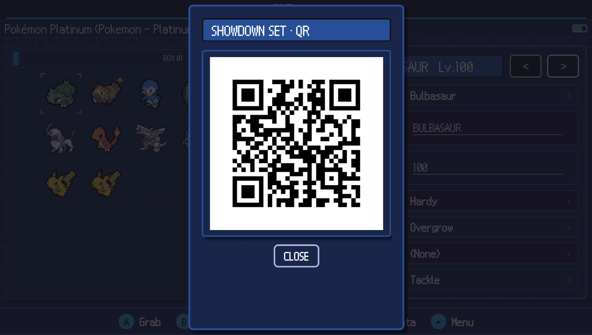
</p>

<p align="center">
  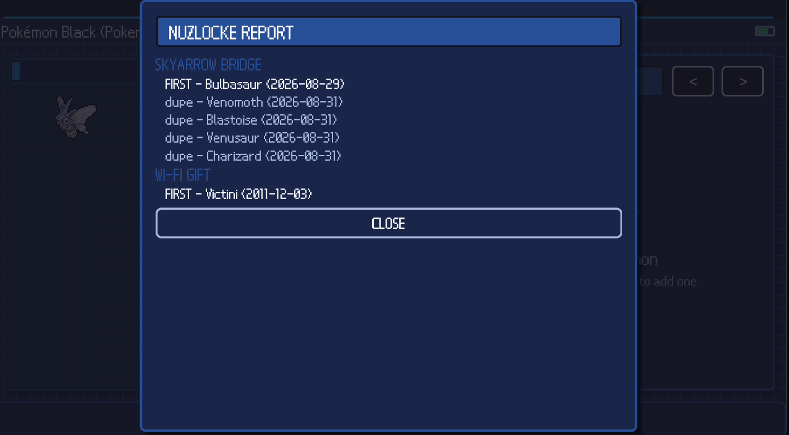
  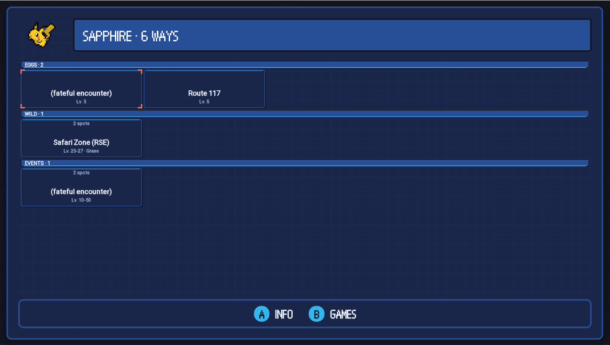
</p>

## Supported games

PKForge reads and edits saves from every mainline generation, plus the GameCube side
games and popular romhacks:

- **Generation I:** Red, Blue, Green (JP), Yellow
- **Generation II:** Gold, Silver, Crystal
- **Generation III:** Ruby, Sapphire, Emerald, FireRed, LeafGreen, Pokémon Box: Ruby & Sapphire, Colosseum, XD: Gale of Darkness
- **Generation IV:** Diamond, Pearl, Platinum, HeartGold, SoulSilver
- **Generation V:** Black, White, Black 2, White 2
- **Generation VI:** X, Y, Omega Ruby, Alpha Sapphire
- **Generation VII:** Sun, Moon, Ultra Sun, Ultra Moon, Let's Go Pikachu, Let's Go Eevee
- **Generation VIII:** Sword, Shield, Brilliant Diamond, Shining Pearl, Legends: Arceus
- **Generation IX:** Scarlet, Violet
- **Romhacks:** Pokémon Unbound, Luminescent Platinum, Pokémon Compass

## Supported emulators

Link a storage unit and PKForge finds your saves automatically:

- **Game Boy / Game Boy Color:** RetroArch, Linkboy, Pizza Boy C
- **Game Boy Advance:** RetroArch, Linkboy, Pizza Boy A
- **Nintendo DS:** melonDS, DraStic, RetroArch
- **GameCube:** Dolphin
- **Nintendo 3DS:** Azahar
- **Nintendo Switch:** Eden

You can also open a single save file directly.

## Save safety

Every write follows **validate → backup → atomic write**. No exceptions, even for bulk
operations. An invalid candidate means no backup and no write. Your saves are never at
risk.

## Installation

Download the APK from [Releases](https://github.com/sofianeelhor/PKForge/releases) and
allow installs from unknown sources. First run walks you through linking an emulator
(RetroArch, melonDS, Azahar, Eden) or opening a single save file.

## 💬 Discord

Join for updates, support, bug reports, feature requests, or just to chat about the project.

👉 **[Join the PKForge Discord](https://discord.gg/bMtzZmTDfu)**

[](https://discord.gg/bGKEyfY)

## Building

.NET 10 SDK with the `maui-android` workload, Android SDK (API 36).

```bash
git submodule update --init --recursive
dotnet test tests/PKForge.Domain.Tests/PKForge.Domain.Tests.csproj
dotnet test tests/PKForge.Engine.Tests/PKForge.Engine.Tests.csproj
dotnet build src/PKForge.App/PKForge.App.csproj -f net10.0-android
```

Version tags build and publish the APK from CI.

### Layout

```
src/PKForge.Domain          contracts and DTOs, no engine or Android dependencies
src/PKForge.Engine          adapters over pinned PKHeX.Core
src/PKForge.AutoMod         compiles the Auto Legality Mod against our Core
src/PKForge.Infrastructure  bank, backups, atomic save writer
src/PKForge.App             MAUI app, SkiaSharp UI, gamepad and second screen
src/PKForge.Chrome          the design system: tokens and painters, pure Skia
tools/ChromePreview         renders the design system off-device
docs/                       architecture, bank model, development, art direction
```

## Credits

- [PKHeX](https://github.com/kwsch/PKHeX), the engine everything runs on
- [PKHeX-Plugins / Auto Legality Mod](https://github.com/santacrab2/PKHeX-Plugins), the
  offline legalizer compiled in-process
- [PKSM](https://github.com/FlagBrew/PKSM), the pixel chrome this UI builds on (GPL-3,
  see src/PKForge.App/Resources/UI/ATTRIBUTION.md)
- [SteamGridDB](https://www.steamgriddb.com), cartridge icons, second-screen logos, and
  hero banners for the game library (community submissions; see
  src/PKForge.App/Resources/GameArt/ATTRIBUTION.md)
- [PokeAPI](https://pokeapi.co), item art fetched at runtime and cached on device
- [game-icons.net](https://game-icons.net) (CC-BY 3.0, © Lorc, Delapouite, Guard13007,
  Carl Olsen and other contributing artists), UI symbols
- [Bulbagarden Archives](https://archives.bulbagarden.net), Pokérus status sprites
- Sprites and Pokémon names © Nintendo, Creatures Inc., GAME FREAK inc.

## License

GPLv3 or later, inherited from PKHeX.Core. See [LICENSE](LICENSE).