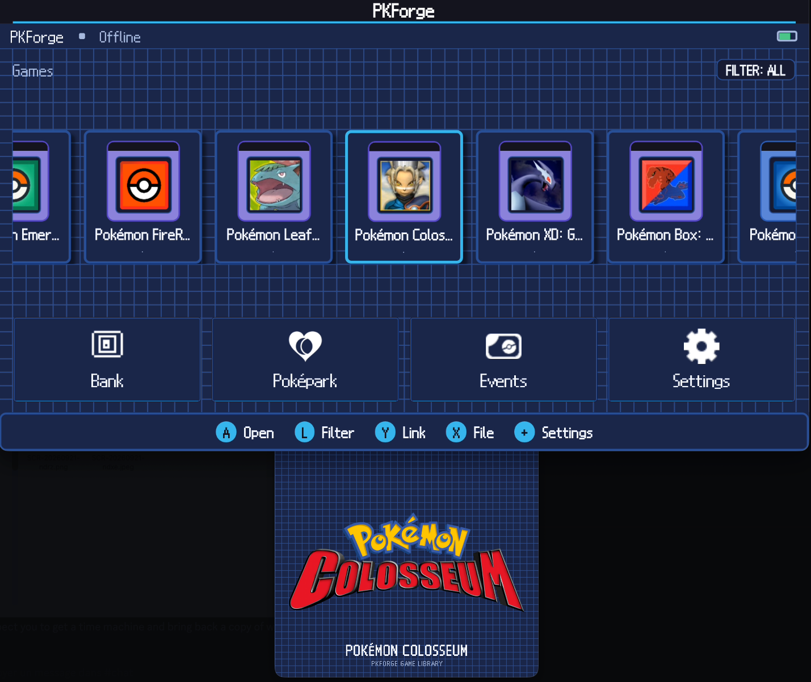

# PKForge

Join the PKForge Discord for updates, support, bug reports, feature requests, and community chat.

[](https://discord.gg/bMtzZmTDfu)

A Pokémon save editor and bank for Android, built for dual-screen handhelds like the
AYN Thor. The whole interface is drawn with SkiaSharp in the visual language of the
DS-era games: box wallpapers, pixel sprites, gamepad controls, and a second screen that
shows a live summary of whatever is under the cursor.



Built on [PKHeX.Core](https://github.com/kwsch/PKHeX)
with the [Auto Legality Mod](https://github.com/santacrab2/PKHeX-Plugins) compiled
in-process, so legalizing a Pokémon works offline, on device.

Not affiliated with Nintendo, Game Freak, or The Pokémon Company.

## What it does

- Open saves from linked emulators (RetroArch, melonDS, Azahar, Eden) or single files
- Edit any Pokémon: stats, moves, Met/Origin, Tera type, Hyper Training, ribbons soon
- One-tap legalize, Showdown import/export, QR codes
- A cross-game bank with unlimited themed boxes
- The mystery-gift database, fully offline, plus community event boxes
- Bag editor, trainer card, Pokédex, restore points


We do not support cheating at the expense of others. Do not use significantly edited
Pokémon in battle or in trades with people who do not know they are edited.

## Install

Download the APK from [Releases](https://github.com/sofianeelhor/PKForge/releases) and
allow installs from unknown sources. First run walks you through linking an emulator.

## Discord

Join for updates, support, bug reports, feature requests, or just to chat about the project.

👉 **[Join the PKForge Discord](https://discord.gg/bMtzZmTDfu)**

## Build

.NET 10 SDK with the `maui-android` workload, Android SDK (API 36).

```bash
git submodule update --init --recursive
dotnet test tests/PKForge.Domain.Tests/PKForge.Domain.Tests.csproj
dotnet test tests/PKForge.Engine.Tests/PKForge.Engine.Tests.csproj
dotnet build src/PKForge.App/PKForge.App.csproj -f net10.0-android
```

Version tags build and publish the APK from CI.

## Layout

```
src/PKForge.Domain          contracts and DTOs, no engine or Android dependencies
src/PKForge.Engine          adapters over pinned PKHeX.Core
src/PKForge.AutoMod         compiles the Auto Legality Mod against our Core
src/PKForge.Infrastructure  bank, backups, atomic save writer
src/PKForge.App             MAUI app, SkiaSharp UI, gamepad and second screen
src/PKForge.Chrome          the design system: tokens and painters, pure Skia
tools/ChromePreview         renders the design system off-device
docs/                       architecture, bank model, development, art direction
```

## Credits

- [PKHeX](https://github.com/kwsch/PKHeX), the engine everything runs on
- [PKSM](https://github.com/FlagBrew/PKSM), the pixel chrome this UI builds on (GPL-3,
  see src/PKForge.App/Resources/UI/ATTRIBUTION.md)
- Sprites and Pokémon names © Nintendo, Creatures Inc., GAME FREAK inc.

## License

GPLv3 or later, inherited from PKHeX.Core. See [LICENSE](LICENSE).
