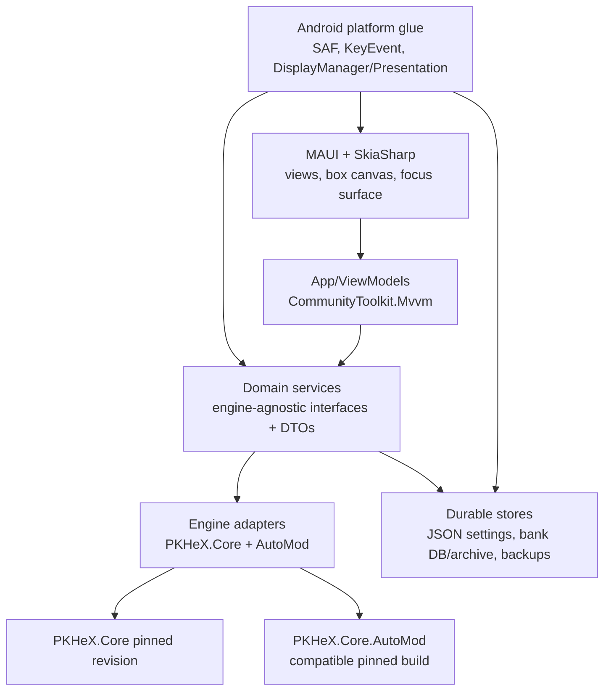

# PKForge architecture

Status: proposed foundation architecture, 2026-07-17. Android-first .NET MAUI; domain remains UI/platform independent.

## Dependency direction

Lower layers never reference MAUI or Android. ViewModels never expose PKHeX types; adapters translate to immutable DTOs. PKHeX.Core and AutoMod are pristine external inputs.

## Projects

- `src/PKForge.Domain`: pure interfaces, records, invariants, save/bank/backup workflows. No MAUI, Android, or PKHeX references.
- `src/PKForge.Engine`: thin PKHeX.Core adapter, format detection, PKM/SaveFile serialization, legality, conversion, Showdown. References pinned Core and compatible AutoMod only.
- `src/PKForge.Infrastructure`: JSON bank/settings, backup/version store, atomic commit coordinator, and abstractions over byte streams. No Android APIs.
- `src/PKForge.App`: MAUI application, ViewModels, pages, SkiaSharp surfaces, DI composition root.
- `src/PKForge.Android`: Android platform services: SAF URI streams and persistable grants, emulator scanner, gamepad event/focus bridge, secondary-display Presentation host.
- `tests/PKForge.Domain.Tests`: deterministic headless behavior tests; save corpus tests live beside engine tests and are excluded from UI concerns.

A solution-level Android app may reference Domain, Engine, Infrastructure, and platform services through interfaces. Domain does not reference any concrete project.

## Core workflows

### Safe save write

1. `ISaveFileAccess` opens the selected SAF document and reads bytes.
2. `ISaveEngine` detects format and produces a read model plus an isolated mutable clone.
3. UI edits domain DTOs; adapter applies edits to the clone.
4. `IBackupService` persists a timestamped version containing original bytes, content hash, detected format, URI identity, and metadata. Backup completion is a hard precondition.
5. Adapter serializes clone to a temporary stream, reparses it with Core, validates checksums/format, and verifies intended mutation.
6. `IAtomicSaveWriter` replaces the SAF document using a provider-safe transactional strategy. If provider cannot guarantee replace semantics, write is refused rather than downgraded.
7. A write journal records backup ID, old/new hashes, and validation result. Undo is a restore operation through the same backup/write pipeline.

No operation mutates the original byte buffer before backup. NAND/SD tree injection uses a separate high-confirmation workflow and never silently falls back to raw paths.

### Focus and dual displays

`IFocusNavigationManager` owns registered focus regions and the current logical selection. Touch, dpad, analog stick, A/B/X/Y, Start, and L/R produce the same navigation commands. Android `MainActivity` translates `DispatchKeyEvent`/`OnGenericMotionEvent`; the UI only consumes commands. A secondary display receives a surface model through `ISecondaryDisplayHost`; when unavailable, the same model is composed into the primary navigation stack.

The first vertical slice is a Skia grid proof-of-concept plus a `DisplayManager`/`Presentation` hello surface. Neither is coupled to save mutation.

## Service contracts

Required domain ports: `ISaveService`, `ISaveFileAccess`, `ILegalityService`, `ILegalizerService`, `IBankService`, `ISpriteService`, `IBackupService`, `IShowdownService`, `IBatchService`, `IEncounterService`, `IEmulatorDetectionService`, `IAtomicSaveWriter`, and `IFocusNavigationManager`.

Every port is registered in MAUI DI and has a fake/in-memory implementation for headless tests. DTOs carry stable IDs, raw entity bytes where applicable, format/generation, provenance, and explicit validation state.

## Non-negotiable invariants

- Backup succeeds before every mutation.
- Writes are validated and atomic; failures preserve the original.
- Unedited save round trips byte-identically.
- All mutation commands are undoable.
- Offline operation is complete for core editing/legality; network is optional sprite-pack input only.
- Core API churn is isolated to Engine.
